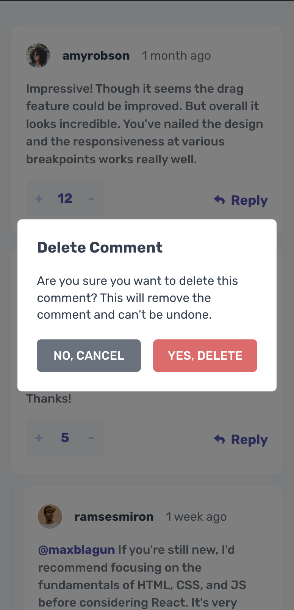

# Frontend Mentor - Interactive comments section solution

This is a solution to the [Interactive comments section challenge on Frontend Mentor](https://www.frontendmentor.io/challenges/interactive-comments-section-iG1RugEG9). Frontend Mentor challenges help you improve your coding skills by building realistic projects.

## Table of contents

- [Overview](#overview)
  - [The challenge](#the-challenge)
  - [Screenshot](#screenshot)
  - [Links](#links)
- [My process](#my-process)
  - [Built with](#built-with)
  - [What I implemented](#what-i-implemented)

## Overview

### The challenge

Users should be able to:

- [x] View the optimal layout for the app depending on their device's screen size
- [x] See hover states for all interactive elements on the page
- [x] Create, Read, Update, and Delete comments and replies
- [x] Upvote and downvote comments
- [x] **Bonus**: If you're building a purely front-end project, use `localStorage` to save the current state in the browser that persists when the browser is refreshed.
- [x] **Bonus**: Instead of using the `createdAt` strings from the `data.json` file, try using timestamps and dynamically track the time since the comment or reply was posted.

### Screenshot

|                            Desktop                            |
| :-----------------------------------------------------------: |
|                                          |
|                          **Mobile**                           |
|  |

### Links

- Solution URL: [Github](https://github.com/RylanZhou/frontend-mentor-interactive-comments-section)
- Live Site URL: [Vercel](https://frontend-mentor-multi-step-form-nu.vercel.app/)

## My process

### Built with

- Scss
- Flexbox
- Mobile-first workflow
- [React](https://reactjs.org/) - JS library
- [timeago.js](https://timeagojs.org/) - JS Library
- React Context Hook
- TypeScript

### What I implemented

1. Use the recently released css unit `dvw` and `dvh` to set the width and height to automatically make the element fit in any viewport size.

2. Use `createContext` and `useContext()` hook to store and access state in different forms and to control current step and sync with localStorage.

3. Call `DeleteModal.confirm()` to bring up the Delete Modal instead of directly controlling the visibility from parent elements.

4. Use `setInterval` to render `createdAt` every second on the page with `timeago.js`.
